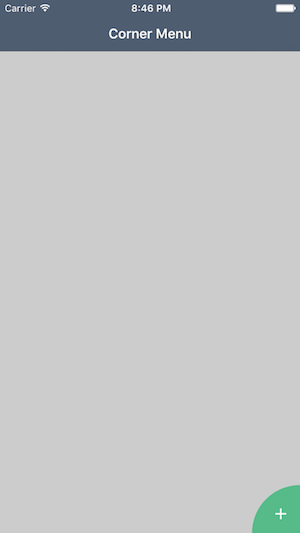
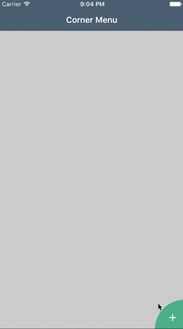

# CornerMenu

A new and efficient UX menu layout

The menu/kebab/flying menu is dying. It has done is time although the button for it is in the less reachable part of the screen (when your right handed). More and more, companies revert to classical navigation tab bar. 

The idea behind CornerButton was how to re-think the menu so it is very accessible, easy and ergonomic. The first step was to place a button on the most accessible part of the screen (assuming you're right handed).



Once done, let's innovate !



## Usage

```Objective-C
    self.cornerMenu = [[LGCornerMenu alloc] initInView:self.navigationController.view];
    self.cornerMenu.delegate = self;
    self.cornerMenu.dataSource = self;
```

### Methods of datasource

```Objective-C

    @property (nonatomic, strong) NSArray<LGMenu *> *menus;

    - (NSUInteger)numberOfItemsInCornerMenu:(LGCornerMenu *)cornerMenu
    {
        return self.menus.count;
    }
    
    - (LGMenu *)cornerMenu:(LGCornerMenu *)cornerMenu itemAtIndex:(NSUInteger)index
    {
        return self.menus[index];
    }
```

### Methods of delegate

```Objective-C
    - (void)cornerMenu:(LGCornerMenu *)cornerMenu didSelectMenuAtIndex:(NSUInteger)index
    {
        // Do your implementation here
    }
```

## Customization

COMING

## TODO

- Adjust height of the menu to the number of menus
- Handle large amount of menus to have a grid